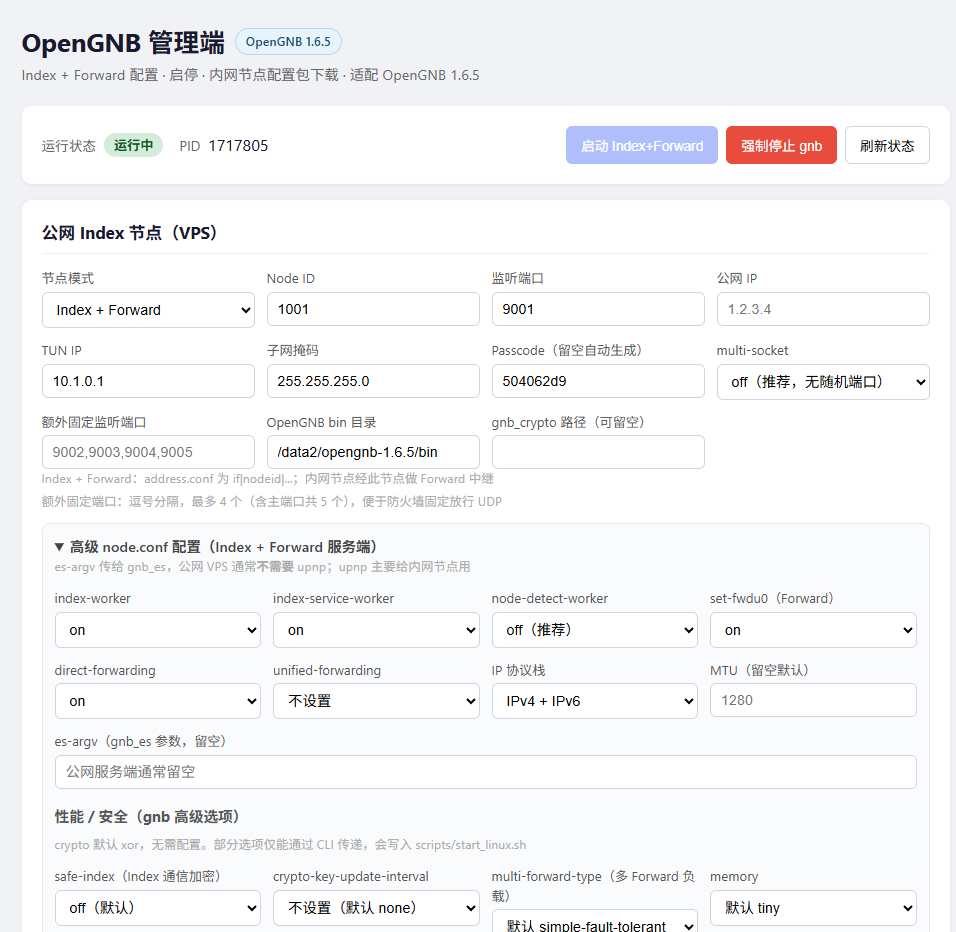
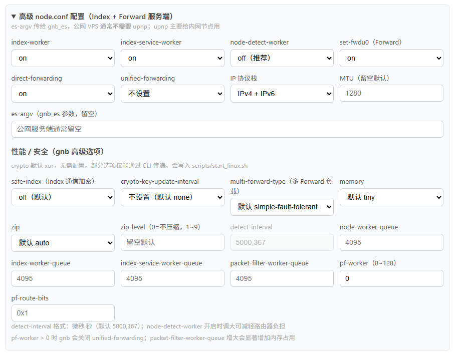
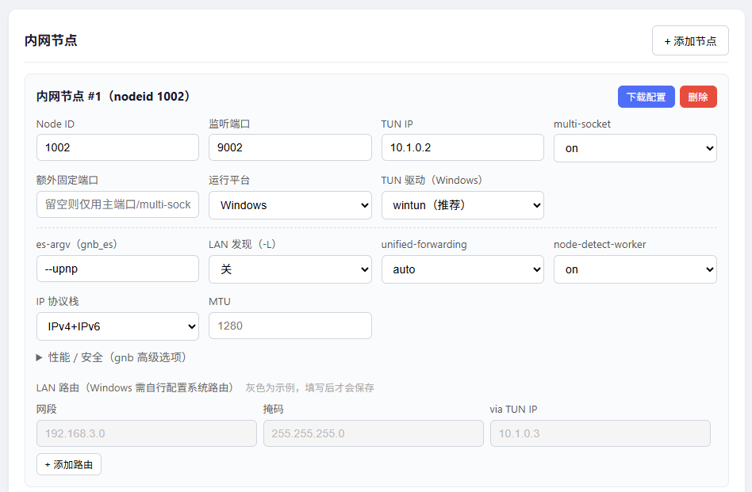
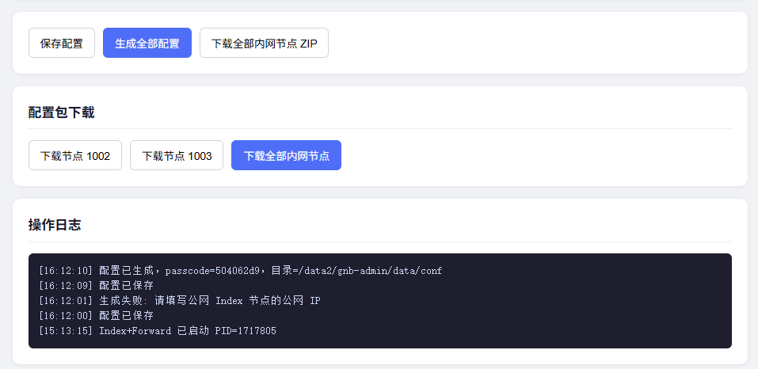

# OpenGNB 管理端

零第三方依赖的 Web 管理工具，用于在公网 VPS 上管理 **Index + Forward** 节点，并生成内网节点（1002/1003 等）完整配置包。

## 界面预览

### 总览：公网 Index 节点与运行状态



顶部显示运行状态与 PID；下方配置公网 Index 节点（节点模式、监听端口、公网 IP、multi-socket、额外固定端口等）。

### 高级配置：Index 服务端与 gnb 高级选项



展开后可配置 index-worker、Forward 相关开关、MTU、safe-index、memory、pf-worker 等高级项。

### 内网节点：含 Windows 平台与 wintun



每个内网节点可单独设置运行平台（Linux / Windows）、TUN 驱动、es-argv、LAN 路由等。

### 生成配置、下载与操作日志



先保存 → 生成全部配置 → 下载单节点或批量 ZIP；底部日志区可查看 passcode、错误提示与启动 PID。

## 特性

- **零 pip 依赖**：仅 Python 3 标准库
- **单文件后端** + 静态 HTML，无需 npm 构建
- Index + Forward 配置、启停、运行状态查看
- 自动生成 ed25519 密钥（调用 `gnb_crypto`）并交叉分发公钥
- 每个内网节点单独下载配置 ZIP，或批量下载
- OpenGNB **bin 目录**一键填写，自动识别 `gnb` / `gnb_crypto`
- **gnb 文件日志**：可开关、可配置路径（默认 `logs/gnb-{nodeid}.log`），页面内查看运行日志
- LAN 路由以灰色示例展示，用户填写后才写入配置

## 前置条件

在管理端所在服务器安装 OpenGNB：

```bash
git clone https://github.com/opengnb/opengnb.git
cd opengnb && make -f Makefile.linux install
# 二进制通常在 opengnb/bin/ 目录下
```

确认可执行文件存在：

```bash
ls /data2/opengnb-1.6.5/bin/gnb
ls /data2/opengnb-1.6.5/bin/gnb_crypto
```

## 快速启动

```bash
cd gnb-admin
chmod +x start.sh
./start.sh
```

浏览器访问 `http://服务器IP:8080/`

或直接：

```bash
python3 app.py --host 0.0.0.0 --port 8080
```

## 环境变量（可选）

| 变量 | 说明 | 默认 |
|------|------|------|
| `GNB_BIN` | OpenGNB **bin 目录**或 `gnb` 完整路径 | `/data2/opengnb-1.6.5/bin` |
| `GNB_CRYPTO_BIN` | `gnb_crypto` 路径，留空则与 `gnb` 同目录 | 空 |
| `GNB_ADMIN_TOKEN` | API 鉴权 Token | 未设置（无鉴权） |
| `GNB_ADMIN_HOST` | 监听地址 | `0.0.0.0` |
| `GNB_ADMIN_PORT` | 监听端口 | `8080` |

启用鉴权示例：

```bash
export GNB_ADMIN_TOKEN="your-secret-token"
export GNB_BIN=/data2/opengnb-1.6.5/bin
./start.sh
```

首次访问页面时如设置了 Token，浏览器会提示输入。

## 使用流程

1. 填写 **Index + Forward** 公网 IP、端口、TUN 地址
2. Index 节点建议 **`multi-socket off`**（默认）；如需多 UDP 通道且便于防火墙，可填 **额外固定监听端口**（如 `9002,9003,9004,9005`）
3. 确认 **OpenGNB bin 目录**（默认 `/data2/opengnb-1.6.5/bin`），`gnb_crypto` 可留空
4. 按需添加内网节点（1002、1003…）；内网节点默认 `multi-socket on` + upnp
5. **LAN 路由**（可选）：灰色文字为示例，三个字段都填写后才会保存
6. 点击 **生成全部配置**（必须先成功生成，再启动）。默认**保留已有密钥**，仅更新 conf / 脚本；勾选「重新生成密钥」才会替换全部 ed25519 密钥
7. 点击 **启动 Index+Forward**
8. 若需排查问题，在 Index 区开启 **gnb 文件日志**（路径默认 `logs/gnb-1001.log`，相对 `gnb-admin` 根目录），重新生成配置并重启；在 **gnb 运行日志** 卡片刷新查看
9. 在各内网节点卡片点 **下载配置**，或批量下载 ZIP，部署到对应主机：

```bash
# 解压后将 gnb/conf/1002/ 放到 gnb 程序目录下
gnb -c gnb/conf/1002   # 内网节点需 root
```

## 目录结构

```
gnb-admin/
├── app.py          # 后端（配置生成、启停、下载）
├── start.sh        # 启动脚本
├── images/         # README 界面截图
├── static/         # Web 前端
└── data/           # 运行时数据（自动生成，勿提交 git）
    ├── network.json
    ├── conf/       # 生成的 GNB 配置（1001/1002/…）
    ├── logs/       # index_forward.log（管理端捕获 stdout）；开启 gnb 日志时另有 logs/gnb-*.log
    └── index_forward.pid
```

## 生成的配置说明

完整配置项说明见 **[docs/GNB配置项说明.md](docs/GNB配置项说明.md)**（常用 / 高级分类，对齐 OpenGNB 1.6.5）。

| 节点 | 角色 | 说明 |
|------|------|------|
| 1001 | Index + Forward | `multi-socket off`（默认），`set-tun off`，无需 root |
| 1002/1003… | 内网节点 | `multi-socket on` + upnp，可配额外固定端口 |

**内网节点运行平台**（每个节点可单独设置）：

| 平台 | node.conf | 启动脚本 |
|------|-----------|----------|
| **Linux / OpenWRT**（默认） | 不写 `if-drv` | `scripts/start_linux.sh` |
| **Windows** | `if-drv wintun`（或 tap-windows） | `scripts/start_windows.bat` |

Windows 客户端需先安装 [Wintun](https://www.wintun.net/) 或 tap-windows 驱动；LAN 路由需在本机手动配置（不生成 `if_up_linux.sh`）。

每个节点 ZIP 包含：`node.conf`、`address.conf`、`route.conf`、ed25519 密钥、启动脚本，以及 `scripts/if_up_linux.sh`（Linux 且有 LAN 路由时）。

## 常见问题

**生成配置失败：找不到 gnb_crypto**

填写正确的 bin 目录，或填写 `gnb_crypto` 完整路径。

**启动返回 400**

按顺序操作：先 **生成全部配置**，再 **启动**；查看页面底部操作日志中的具体错误，或：

```bash
cat data/logs/index_forward.log
```

**设置了 GNB_ADMIN_TOKEN 后下载失败**

页面会自动携带 Token；若 Token 变更，清除浏览器 localStorage 后重新输入。

## 防火墙端口说明

Index + Forward 节点默认 **`multi-socket off`**，仅监听主端口（如 UDP 9001）。

| 配置 | 效果 |
|------|------|
| `multi-socket off` + 无额外端口 | 仅 `listen` 主端口，防火墙只开 9001 即可 |
| `multi-socket on` | 额外随机 4 个 UDP 高端口（重启后可能变化） |
| **额外固定监听端口** | 如 `9002,9003,9004,9005`，最多 4 个，便于安全组固定放行 |

内网节点默认 `multi-socket on` + upnp，随机端口在各自 LAN 网关处理。

### es-argv 说明

`es-argv` 是传给 **gnb_es** 辅助进程的参数（不是 gnb 本体参数）。gnb_es 负责 upnp、LAN 发现等：

| 节点 | es-argv 建议 | 说明 |
|------|-------------|------|
| **Index+Forward（公网 VPS）** | **留空** | 有公网 IP，不需要 upnp |
| **内网节点** | `--upnp` | 在网关做端口映射，提升 NAT 穿透 |
| **内网多节点同 LAN** | `--upnp -L` | 加 `-L` 开启 LAN 内互相发现 |

### 节点模式

| 模式 | address.conf | node.conf |
|------|--------------|-----------|
| **Index + Forward**（默认） | `if\|1001\|公网IP\|9001` | set-fwdu0 on、direct-forwarding on |
| **仅 Index** | `i\|1001\|公网IP\|9001` | set-fwdu0 off、direct-forwarding off |

在 Web 界面「节点模式」选 **仅 Index（关闭 Forward）** 即可；内网节点生成的 `address.conf` 也会同步改为 `i|...`，不再走 Forward 中继。

| pf-route-bits | 不设置 | 经 Forward 中继路由位掩码（如 0x1） |

### gnb 高级选项（1.6.x）

依据 [OpenGNB 手册](https://github.com/opengnb/opengnb/blob/master/docs/gnb_user_manual_cn.md) 与 1.6.5 源码实现。`crypto` 固定默认 **xor**，不在界面暴露。

| 选项 | 写入方式 | 说明 |
|------|----------|------|
| safe-index | node.conf | Index 通信加密（on/off） |
| crypto-key-update-interval | CLI / start_linux.sh | hour / minute，需节点时钟同步 |
| multi-forward-type | CLI / start_linux.sh | net-to-net 多网关节点负载均衡 |
| memory | node.conf | tiny / small / large / huge |
| zip / zip-level | node.conf | 数据压缩 |
| detect-interval | node.conf | 格式 `微秒,秒`，默认 5000,367 |
| *-worker-queue | CLI / start_linux.sh | 默认 4095，留空不写 |
| pf-worker | node.conf | 多核处理线程数 0~128 |
| pf-route-bits | node.conf | 如 0x1：未直接交换密钥的节点可经 Forward 通讯 |

生成配置后，每个节点目录含 `scripts/start_linux.sh`，内网节点启动示例：

```bash
chmod +x scripts/start_linux.sh
./scripts/start_linux.sh
# 或：GNB_BIN=/path/to/gnb ./scripts/start_linux.sh
```

管理端启动公网 Index 节点时，也会自动附加相同的 CLI 参数。

### 服务端（Index / Index+Forward）可配项

| 配置项 | 默认 | 作用 |
|--------|------|------|
| index-worker | on | Index 索引服务 |
| index-service-worker | on | 公共 Index 协议 |
| node-detect-worker | **off** | 端口探测（公网服务端建议关） |
| set-fwdu0 | on | Forward 转发 |
| direct-forwarding | on | 点对点转发 |
| unified-forwarding | 不设置 | 统一转发（服务端一般不需要） |
| es-argv | 空 | gnb_es 参数 |

## 安全建议

- 生产环境务必设置 `GNB_ADMIN_TOKEN`
- 用防火墙限制 8080 端口仅管理员 IP 可访问
- Forward 节点不要公开 passcode 和配置包
- VPS 防火墙放行 Index+Forward 的 UDP 监听端口（默认 9001）

## systemd 示例（可选）

```ini
[Unit]
Description=OpenGNB Admin
After=network.target

[Service]
Type=simple
WorkingDirectory=/data2/gnb-admin
Environment=GNB_ADMIN_TOKEN=change-me
Environment=GNB_BIN=/data2/opengnb-1.6.5/bin
ExecStart=/usr/bin/python3 /data2/gnb-admin/app.py --host 0.0.0.0 --port 8080
Restart=on-failure

[Install]
WantedBy=multi-user.target
```
